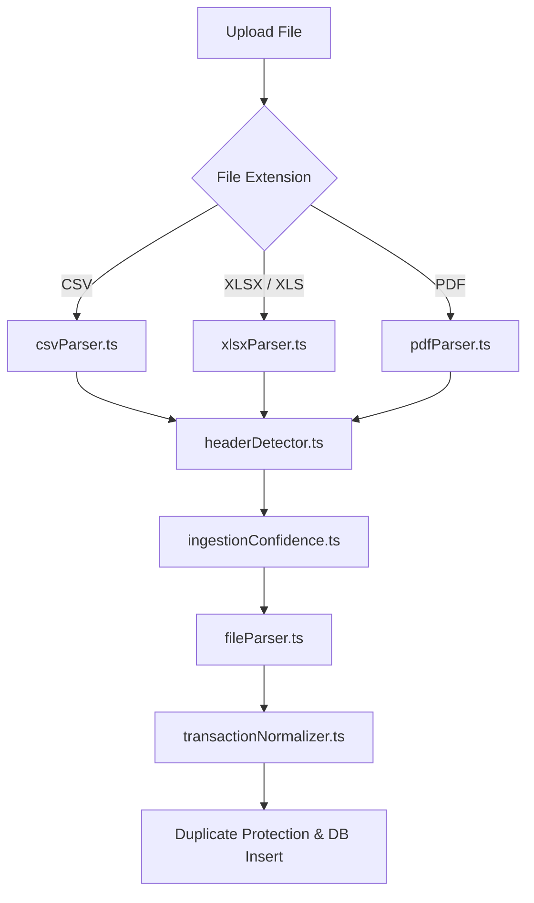

# Phase 12 Implementation Plan: Hardcore CSV/XLSX/PDF Ingestion Engine

Make Kaeo handle real-world messy financial statement files with high-fidelity accuracy, custom sheet selectors, structured error/warning feedback, and robust duplicate row safeguards.

---

## Technical Architecture Overview

To support a robust, resilient multi-format financial parser, we will build a modular parsing architecture under `src/lib/ingestion/`. This isolates file types, header scoring, mapping, and normalization rules.

---

## User Review Required

> [!IMPORTANT]
> **Dynamic Library Installation**:
> - We will install standard npm packages: `xlsx` (SheetJS) to parse Excel sheets.
> - For text-based PDFs, we will implement a clean client-side extractor utilizing `pdfjs-dist` loaded from a secure CDN script tag or standard import to avoid bundling issues with Vite/React 19.

---

## Proposed Changes

### 1. Ingestion Engine Architecture

#### [NEW] [ingestionTypes.ts](file:///c:/Users/sreev/kaeo/src/lib/ingestion/ingestionTypes.ts)
Contains all TypeScript interfaces and type definitions for parsers, headers, suggestions, and sheets.

#### [NEW] [headerDetector.ts](file:///c:/Users/sreev/kaeo/src/lib/ingestion/headerDetector.ts)
- Scans up to 30 rows of messy data.
- Scores rows based on date, description, and amount/balance keywords.
- Automatically isolates the best header row, skipping title rows, and keeps track of skipped offset counts.
- Flags and filters out repeatedly occurring headers inside statement files.

#### [NEW] [csvParser.ts](file:///c:/Users/sreev/kaeo/src/lib/ingestion/csvParser.ts)
- Custom wrapper for PapaParse.
- Auto-detects delimiters (comma, semicolon, tab).
- Handles messy headers, spacing, and trailing footer lines.

#### [NEW] [xlsxParser.ts](file:///c:/Users/sreev/kaeo/src/lib/ingestion/xlsxParser.ts)
- Leverages the `xlsx` package to read Excel workbooks.
- Parses multiple sheets and computes a "sheet score" (based on date, amount, description column detection and row density) to auto-select the best sheet.
- Extracts full data rows and parses merged headers/cells.

#### [NEW] [pdfParser.ts](file:///c:/Users/sreev/kaeo/src/lib/ingestion/pdfParser.ts)
- Safe table-extractor for text-based statement PDFs.
- Parses lines using regular expressions to extract structured `date`, `description`, and `amount` cells.
- Sets low confidence if extraction is uncertain and requires manual review.

#### [NEW] [transactionNormalizer.ts](file:///c:/Users/sreev/kaeo/src/lib/ingestion/transactionNormalizer.ts)
- Decodes signed amounts, withdrawal/deposit columns, and debit/credit mappings.
- Decodes parentheses, currency symbols, and `DR`/`CR` markers.
- Converts multiple date schemas (DD/MM/YYYY, DD-MM-YYYY, YYYY-MM-DD, text months like 12-May-2026).
- Flags date ambiguity warnings (e.g. `05/06/2026`).
- Filters out opening balance, subtotal, and closing balance rows.

#### [NEW] [ingestionConfidence.ts](file:///c:/Users/sreev/kaeo/src/lib/ingestion/ingestionConfidence.ts)
- Computes combined score: High (>=90%), Medium (50-89%), and Low (<50%).
- Restricts auto-import for low-confidence sheets.

#### [MODIFY] [fileParser.ts](file:///c:/Users/sreev/kaeo/src/lib/fileParser.ts)
Refactor the primary entry point to orchestrate these formats and return the standardized `ParsedFinancialFile` structure.

---

### 2. Duplicate Row Protections

#### [NEW] [duplicateEngine.ts](file:///c:/Users/sreev/kaeo/src/lib/ingestion/duplicateEngine.ts)
- Computes deterministic transaction fingerprints (hash based on client_id, date, sanitized description, and absolute amount).
- Compares uploaded transaction sets against itself and active transactions in the database.
- Displays an alert banner detailing duplicate statistics and automatically filters out redundant rows during final insertion.

---

### 3. Database Migration

#### [NEW] [0015_ingestion_hardening.sql](file:///c:/Users/sreev/kaeo/supabase/migrations/0015_ingestion_hardening.sql)
Add auditing columns to existing tables using `IF NOT EXISTS` to support complex file ingestion tracking safely:
- `uploaded_files.file_type` (e.g. `xlsx`, `pdf`)
- `imports.selected_sheet_name`
- `imports.detected_header_row`
- `imports.skipped_rows_json`
- `imports.ingestion_confidence`
- `imports.ingestion_warnings_json`
- `transactions.source_row_hash`

---

### 4. Frontend & User Interface Upgrades

#### [MODIFY] [Files.tsx](file:///c:/Users/sreev/kaeo/src/pages/Files.tsx)
- Replaces CSV-only validation with support for `.csv`, `.xlsx`, `.pdf`.
- Displays dynamic file format badges, confidence ratings, and parsed statistics.
- If multiple sheets exist, renders a custom tabs bar letting users switch Excel worksheets seamlessly.
- Enforces Phase 11 billing guards on file counts and row caps.

#### [MODIFY] [FilePreview.tsx](file:///c:/Users/sreev/kaeo/src/components/files/FilePreview.tsx)
- Renders detailed parsed sheets and confidence indicators.
- Displays warnings and auto-import block actions for low-confidence uploads.

#### [MODIFY] [Mapping.tsx](file:///c:/Users/sreev/kaeo/src/pages/Mapping.tsx)
- Connects multi-column (debit/credit) overrides.
- Refreshes preview normalization instantly in real-time.

---

### 5. Ingestion Test Datasets

We will generate small test statement files inside [test-data/ingestion/](file:///c:/Users/sreev/kaeo/test-data/ingestion/):
- `clean_bank.csv` (Normal clean statement)
- `messy_title_rows.csv` (CSV with blank rows & headers offset)
- `debit_credit_columns.csv` (Separate debit/credit statement)
- `amount_signed.csv` (Negative/positive signed values)
- `repeated_headers.csv` (Multiple paginated headers in mid-sheet)
- `multi_sheet_statement.xlsx` (Excel workbook with data & blank tabs)
- `low_confidence_missing_description.csv` (No payee/narration field)
- `duplicate_rows.csv` (Contains overlapping transaction records)

---

## Verification Plan

### Automated Build Verification
- Execute `npm run build` to verify compiling soundness.

### Ingestion & Normalization Verification
- Upload each messy test file and check:
  - Skipped row metrics match header rows.
  - Multi-column credits map safely as income and debits as expenses.
  - Duplicate rows trigger visual warnings and bypass redundant database insertion.
  - Excluded summary balance lines (footers, headers) do not insert.
- Update `qa-checklist.md` with detailed checks.
